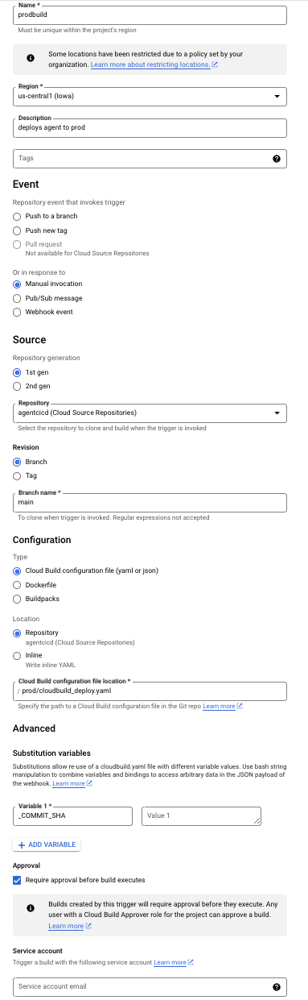

This Document outlines how to use this sample code and set up the CICD
pipeline in your gcp projects.

# Primer

Using this CICD pipeline, you can

-   Promote/migrate agent across 3 GCP projects a.k.a dev -\> uat -\>
    prod

**In dev project**

-   Export agent from a designated DFCX environment from dev(coming from
    config file)

-   Automatically detects which flows are impacted based on history and
    in dev project and save it in metadata file

-   Automatically sync the flows in deployed DFCX environments once a
    flow is deployed in prod

**In UAT project**

-   Creates new versions of only those impacted flows in uat and deploy
    them to designated DFCX environment(coming from config file)

-   Run test cases relevant to impacted flows and roll back if failed in
    UAT

-   Automatically delete the previous older versions of flows in uat and
    prod once the limit is reached

-   Update the webhook apigee environment in the webhook url
    corresponding to UAT project

-   If there are multiple languages configured in the agent, it will
    automatically verify other languages pages against English language
    pages to see if agent fulfillments/response are present in every
    other languages configured.

-   Gives mechanism for UAT team to approve in UI once testing is
    completed and deploy the agent to prod post the approval

-   Automatically sync the flows in deployed DFCX environments once a
    flow is deployed in prod

**In Prod project**

-   Post UAT team approves after UAT testing, It creates new versions of
    only those impacted flows in prod and deploy them to designated DFCX
    environment(coming from config file)

-   Update the webhook apigee environment in the webhook url
    corresponding to prod project

-   Automatically delete the previous older versions of flows in uat and
    prod once the limit is reached

-   Automatically deploys the impacted flows and deploy to serving DFCX
    environment in prod

# High level architecture

# 

# 

# Set up

## Assumptions:

1.  You have GCP account already

2.  You have created 3 separate projects for dev/uat/prod

3.  You have an agent in dev and created a dummy/empty agent in the same
    name in uat and prod project.

4.  You have a git or similar repo to store the code and agent
    artifacts.

5.  You might require to have all the cloud builds you see above in the
    architecture in devops project centrally.

## IAM Permissions 

For the DevOps project to deploy the agents to respective environments
it needs necessary permissions.

The Cloud Build uses a default service account
**\<devops-project-id\>@@[[cloudbuild.gserviceaccount.com]{.underline}](http://cloudbuild.gserviceaccount.com)**
to run the Cloud Build service.This service account needs the following
IAM permissions on the target project where the agents are being
deployed.

## To the build's service account in devops project, give below roles.

-   **Dialogflow CX API Admin**

-   **Dialogflow API Client**

-   **Storage.admin and storage.object.viewer**

-   **CSR access**

-   **Service Usage Consumer**

-   **Dialogflow \> Dialogflow Test Case Admin**

-   **Dialogflow \> Dialogflow Environment editor**

## For the builds in AUTH and PROD project, 

-   Go to devops project \> IAM role \> add principal and give access to
    AUTH/PROD service account as **Service Usage Consumer**

-   Give Auth build with **cloudbuild.builds.get** access

-   Give Prod build's service account and the approve person with
    **cloudbuild.builds.approve** access

## Code Repository and Branching Strategy

This section describes the approach for setting up the repository and
branches for the agents.

**Source Repository**

Below is the reason why we need a repository

1.  Cloud Builds need to refer to some place to access the code that it
    needs to build

2.  Some Cloud Builds are set to get triggered when an agent artifact is
    checked in to the repository automatically.

3.  Maintain an audit trail to see who changed the code

4.  Maintain an audit trail to see who checked in agent artifacts in
    repo along with a commit message that explains what the change in
    agent/flow is.

## Storage Bucket

Create a gcs bucket and that will be used by the pipeline for storing
agents while exporting and restoring. Below is how the bucket structure
might look like.

## Cloud Build Configurations

There are certain configurations that have to be updated that the user
has to fill while triggering Build1 for agent promotion. Following are
the variables that will be defined for the Cloud Build.

-   **\_COMMIT_MESSAGE** - This the URL for the configuring the web-hook

### 

### Export Build:

### UAT deploy build

### Prod deploy build

## DFCX APIs

The Python Dialogflow CX Scripting [[API (DFCX
SCRAPI)]{.underline}](https://github.com/GoogleCloudPlatform/dfcx-scrapi)
is a high level API that extends the official Google [[Python Client for
Dialogflow
CX]{.underline}](https://github.com/googleapis/python-dialogflow-cx).
SCRAPI makes using DFCX easier, more friendly, and more pythonic for bot
builders, developers, and maintainers. This uses V3/V3beta1 endpoints
under the hood. Since it is more pythonic way of implementation,
developers will find it easy to use SCRAPI API in action.

In our CI/CD pipeline below operations are achieved using SCRAPI API

-   Find agent ID from name

-   Find flow id from name

-   [[Export the agent to
    GCS]{.underline}](https://github.com/GoogleCloudPlatform/dfcx-scrapi/blob/37cf8cf7b2013a377740f68d8dcb7355632161e0/src/dfcx_scrapi/core/agents.py#L363)

-   [[Restore the
    agent]{.underline}](https://github.com/GoogleCloudPlatform/dfcx-scrapi/blob/37cf8cf7b2013a377740f68d8dcb7355632161e0/src/dfcx_scrapi/core/agents.py#L438)

-   [[Cut a version of a
    flow]{.underline}](https://github.com/GoogleCloudPlatform/dfcx-scrapi/blob/37cf8cf7b2013a377740f68d8dcb7355632161e0/src/dfcx_scrapi/core/versions.py#L183)

-   [[Deploy it to an
    environment]{.underline}](https://github.com/GoogleCloudPlatform/dfcx-scrapi/blob/37cf8cf7b2013a377740f68d8dcb7355632161e0/src/dfcx_scrapi/core/environments.py#L359)

-   [[Run test
    cases]{.underline}](https://github.com/GoogleCloudPlatform/dfcx-scrapi/blob/37cf8cf7b2013a377740f68d8dcb7355632161e0/src/dfcx_scrapi/core/test_cases.py#L410)

-   [[Compare environment
    history]{.underline}](https://github.com/GoogleCloudPlatform/dfcx-scrapi/blob/37cf8cf7b2013a377740f68d8dcb7355632161e0/src/dfcx_scrapi/core/environments.py#L392)
    to find impacted flow the current instance of CI/CD builds.

## Set up the pipeline 

1.  Setup a git or any code repository of your choice to store the code
    and agent artifacts

2.  Push the code you see in the parent folder along with this
    documentation.

3.  Use the config file as a one stop place to initiate values to
    variables that will be used throughout the pipeline. Hence this
    eases out the maintenance or reusing of the pipeline for different
    values

{

\"agent_name\" : \"carrental\",

\"dev_env_pull\" : \"ready to deploy\",

\"uat_env_deploy\" : \"ready to test\",

\"prod_env_deploy\" :\"deployed\",

\"devprodsyncenv\" :\"deployed\",

\"bucket\": \"DFCX_agent_cicd_export\",

\"dev_project\": \"yourprojectid\",

\"uat_project\" : \"yourprojectid\",

\"prod_project\": \"yourprojectid\",

\"devops_project\": \"yourprojectid\",

\"uat_webhook_env\": \"uat\",

\"prod_webhook_env\": \"prod\",

\"uat_engine_id\" :\"\",

\"prod_engine_id\" :\"\"

}



4.  Create 3 cloud builds with the configuration and name as shown in
    screenshots in the previous section.

5.  Now make changes to your agent and deploy updated flows to the DFCX
    environment as you have configured in config file

6.  Now come to GCP Cloud build and click on run on exportbuild in
    triggers section and input the commit message(basically some lines
    about your change in the agent)

7.  This will deploy agent to uat and you can verify it

8.  Now you can come back to cloud build console and build history tab
    and approve the build that is waiting for your approval and you can
    see that it will deploy the agent in prod post approval
    

## Cavet

1.  Make sure to update the git repository name in the code base in
    export/[[repopush.sh]{.underline}](http://repopush.sh) file

2.  If you datastores linked to the agent, make sure to create datastore
    ids same across all three project

# Benefits

1.  Entire process of agent promotion is automated

2.  Code base is modularized according to best practices

3.  DFCX best practices are configured in the pipeline set up

4.  Same pipeline can be concurrently used for same agents by multiple
    agent developers to deploy their own flow and can be approved to
    deploy individually as we are using commit id/SHA ID as primary
    identifier across one instance of pipeline running.

5.  Datastores configurations will not break if same datastore id is
    used in all the projects
